<br/>

<div align="center">

# Exam Dashboard

## System Design Document

---

**Project Name:** Exam Dashboard

**Document Type:** Software Architecture & System Design

**Prepared By:** Ayman Negm

**Date:** July 30, 2026

---

_This document describes the complete system architecture, database design, API specification, and technology decisions for the Exam Dashboard platform._

</div>

---

<br/>

## Table of Contents

1. [Introduction](#1-introduction)
2. [Vision](#2-vision)
3. [Objectives](#3-objectives)
4. [Project Scope](#4-project-scope)
5. [Functional Requirements](#5-functional-requirements)
6. [Non-Functional Requirements](#6-non-functional-requirements)
7. [Actors](#7-actors)
8. [User Roles](#8-user-roles)
9. [Use Cases](#9-use-cases)
10. [User Stories](#10-user-stories)
11. [High-Level Architecture — Monolithic](#11-high-level-architecture--monolithic)
12. [High-Level Architecture — Microservices](#12-high-level-architecture--microservices)
13. [Architecture Comparison](#13-architecture-comparison)
14. [Database Design](#14-database-design)
15. [ER Diagram](#15-er-diagram)
16. [Authentication Flow](#16-authentication-flow)
17. [JWT Flow](#17-jwt-flow)
18. [Future Enhancements](#18-future-enhancements)
19. [Conclusion](#19-conclusion)

---

<br/>

## 1. Introduction

### 1.1 Purpose

This document provides the authoritative system design specification for the **Exam Dashboard** platform a web-based application that empowers educational institutions to manage their organizational hierarchy (districts, schools), personnel (teachers, students), and academic assessments through a single, unified interface.

### 1.2 Document Scope

This specification covers the **Minimum Viable Product (MVP)** release which includes the landing page, user registration, user login, and JWT-based authentication as well as the **full-scope design** for district, school, teacher, student, and assessment management features planned for subsequent releases.

Both **Monolithic** and **Microservices** architectural approaches are presented, analyzed, and compared. A formal recommendation is provided with detailed justification.

<br/>

## 2. Vision

To build a robust, scalable, and intuitive educational platform that streamlines the entire assessment lifecycle from institutional hierarchy management to assessment creation, submission, and evaluation enabling educators to focus on teaching and students to focus on learning.

---

<br/>

## 3. Objectives

### 3.1 MVP Objectives

The MVP focuses exclusively on establishing the foundational infrastructure:

1. **Landing Page** A public-facing page that communicates the platform's value proposition and directs users to registration or login.
2. **User Registration** A self-service registration flow that creates user accounts with role assignment.
3. **User Login** A credential-based authentication flow that issues JWT tokens.
4. **JWT Authentication** A stateless authentication mechanism that protects all private API endpoints.

---

<br/>

## 4. Project Scope

### 4.1 MVP Scope (Release 1.0)

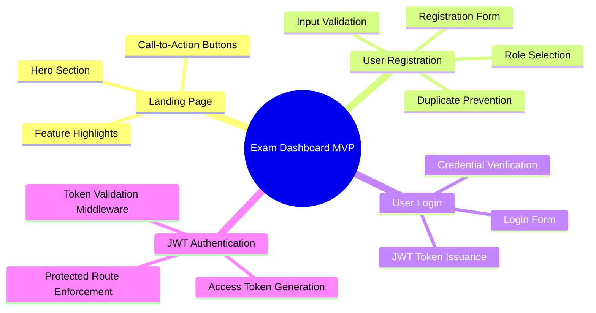

### 4.2 Out of Scope (Future Enhancements)

The following features are acknowledged as valuable enhancements but are explicitly excluded from both the MVP and the planned future scope releases. They are documented here for architectural consideration only:

- Parent Portal
- Analytics Dashboard
- Notification System (email, in-app, push)
- Reporting & Export Engine
- Email Verification
- Password Recovery / Reset
- Mobile Application (iOS / Android)

---

<br/>

<br/>

## 5. Functional Requirements

### 5.1 MVP Functional Requirements

| ID    | Requirement                                                                                                                                                      | Priority  | Module         |
| ----- | ---------------------------------------------------------------------------------------------------------------------------------------------------------------- | --------- | -------------- |
| FR-01 | The system shall display a public landing page with platform information                                                                                         | Must Have | Landing Page   |
| FR-02 | The landing page shall provide navigation links to Register and Login pages                                                                                      | Must Have | Landing Page   |
| FR-03 | The system shall allow new users to register with first name, last name, email, password, and role                                                               | Must Have | Registration   |
| FR-04 | The system shall validate that email addresses are unique across all user accounts                                                                               | Must Have | Registration   |
| FR-05 | The system shall enforce password complexity rules (minimum 8 characters, at least one uppercase letter, one lowercase letter, one digit, one special character) | Must Have | Registration   |
| FR-06 | The system shall hash passwords using BCrypt before database storage                                                                                             | Must Have | Registration   |
| FR-07 | The system shall allow registered users to log in with email and password                                                                                        | Must Have | Authentication |
| FR-08 | The system shall issue a JWT access token upon successful authentication                                                                                         | Must Have | Authentication |
| FR-09 | The system shall reject requests to protected endpoints that lack a valid JWT token                                                                              | Must Have | Authentication |
| FR-10 | The system shall return appropriate HTTP status codes (401 Unauthorized, 403 Forbidden) for authentication and authorization failures                            | Must Have | Authentication |

### 5.2 Future Functional Requirements

| ID    | Requirement                                                                        | Priority  | Module          |
| ----- | ---------------------------------------------------------------------------------- | --------- | --------------- |
| FR-11 | Admins shall be able to create, read, update, and delete districts                 | Must Have | District Mgmt   |
| FR-12 | Admins shall be able to create, read, update, and delete schools within a district | Must Have | School Mgmt     |
| FR-13 | Admins shall be able to assign teachers to schools                                 | Must Have | Teacher Mgmt    |
| FR-14 | Admins shall be able to enroll students in schools                                 | Must Have | Student Mgmt    |
| FR-15 | Teachers shall be able to create, edit, and publish assessments                    | Must Have | Assessment Mgmt |
| FR-16 | Students shall be able to view available assessments and submit responses          | Must Have | Assessment Mgmt |
| FR-17 | The system shall enforce role-based access control on all management operations    | Must Have | Authorization   |

---

<br/>

## 6. Non-Functional Requirements

| ID     | Category            | Requirement                                                       | Target                              |
| ------ | ------------------- | ----------------------------------------------------------------- | ----------------------------------- |
| NFR-01 | **Performance**     | API response time for standard CRUD operations                    | p95 < 500ms                         |
| NFR-02 | **Performance**     | Landing page initial load time (LCP)                              | < 2.5 seconds                       |
| NFR-03 | **Performance**     | Concurrent user support without degradation                       | 500 concurrent users (MVP)          |
| NFR-04 | **Availability**    | System uptime SLA                                                 | 99.5% (MVP); 99.9% (Production)     |
| NFR-05 | **Scalability**     | Horizontal scaling capability                                     | Application layer must be stateless |
| NFR-06 | **Security**        | All data in transit encrypted via TLS 1.2+                        | Mandatory                           |
| NFR-07 | **Security**        | Passwords stored using BCrypt with cost factor ≥ 10               | Mandatory                           |
| NFR-08 | **Security**        | JWT tokens expire within 24 hours                                 | Mandatory                           |
| NFR-09 | **Security**        | SQL injection prevention via parameterized queries                | Mandatory                           |
| NFR-10 | **Security**        | CORS policy restricts origins to known frontend domains           | Mandatory                           |
| NFR-11 | **Usability**       | Responsive design supporting viewport widths from 320px to 2560px | Mandatory                           |
| NFR-12 | **Usability**       | WCAG 2.1 Level AA accessibility compliance                        | Should Have                         |
| NFR-13 | **Maintainability** | Code test coverage for backend services                           | ≥ 80% line coverage                 |
| NFR-14 | **Maintainability** | API documentation auto-generated from code annotations            | Mandatory (Swagger/OpenAPI)         |
| NFR-15 | **Portability**     | Application deployable via Docker containers                      | Mandatory                           |

---

<br/>

## 7. Actors

An **actor** is any external entity — human or system — that interacts with the Exam Dashboard. The following actors have been identified:

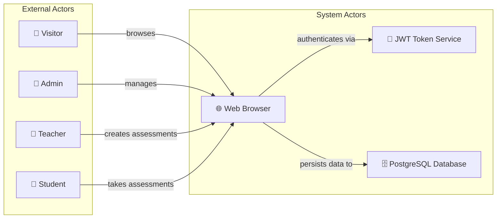

| Actor                   | Type   | Description                                                                                                         |
| ----------------------- | ------ | ------------------------------------------------------------------------------------------------------------------- |
| **Visitor**             | Human  | An unauthenticated user browsing the landing page. May register or log in.                                          |
| **Admin**               | Human  | A privileged user who manages districts, schools, teachers, and students. Full access to organizational entities.   |
| **Teacher**             | Human  | A school affiliated user who creates and manages assessments. Read access to assigned school and enrolled students. |
| **Student**             | Human  | A school enrolled user who views and submits assessments. Read only access to available assessments.                |
| **Web Browser**         | System | The client application (React SPA) rendering the UI and issuing API requests.                                       |
| **JWT Token Service**   | System | The internal authentication component responsible for token issuance and validation.                                |
| **PostgreSQL Database** | System | The persistent data store for all application entities.                                                             |

---

<br/>

## 8. User Roles

The Exam Dashboard implements **Role-Based Access Control (RBAC)** using a single `User` entity with a `role` discriminator. This design avoids the complexity of separate entity tables for each persona while maintaining clean authorization boundaries.

### 8.1 Role Definitions

| Role              | Code      | Description                                                                                                          | Scope         |
| ----------------- | --------- | -------------------------------------------------------------------------------------------------------------------- | ------------- |
| **Administrator** | `ADMIN`   | Full platform management. Creates and manages the institutional hierarchy (districts, schools) and user assignments. | Global        |
| **Teacher**       | `TEACHER` | Assessment lifecycle management. Creates, edits, publishes, and reviews assessments within their assigned school.    | School-scoped |
| **Student**       | `STUDENT` | Assessment participation. Views available assessments, submits responses, and reviews results.                       | School-scoped |

### 8.2 Permission Matrix

| Operation          | ADMIN | TEACHER | STUDENT |
| ------------------ | ----- | ------- | ------- |
| View Landing Page  | ✅    | ✅      | ✅      |
| Register Account   | ✅    | ✅      | ✅      |
| Login              | ✅    | ✅      | ✅      |
| Manage Districts   | ✅    | ❌      | ❌      |
| Manage Schools     | ✅    | ❌      | ❌      |
| Manage Teachers    | ✅    | ❌      | ❌      |
| Manage Students    | ✅    | ❌      | ❌      |
| Create Assessments | ❌    | ✅      | ❌      |
| Edit Assessments   | ❌    | ✅      | ❌      |
| View Assessments   | ✅    | ✅      | ✅      |
| Submit Assessments | ❌    | ❌      | ✅      |
| View Submissions   | ✅    | ✅      | ✅      |

- Students may view only their own submissions.

---

<br/>

## 9. Use Cases

### 9.1 Use Case Diagram

```mermaid
graph TB
    subgraph Exam Dashboard System
        UC1["UC-01: View Landing Page"]
        UC2["UC-02: Register Account"]
        UC3["UC-03: Login"]
        UC4["UC-04: Manage Districts"]
        UC5["UC-05: Manage Schools"]
        UC6["UC-06: Manage Teachers"]
        UC7["UC-07: Manage Students"]
        UC8["UC-08: Create Assessment"]
        UC9["UC-09: Take Assessment"]
        UC10["UC-10: View Submissions"]
    end

    Visitor["👤 Visitor"]
    Admin["👤 Admin"]
    Teacher["👤 Teacher"]
    Student["👤 Student"]

    Visitor --> UC1
    Visitor --> UC2
    Visitor --> UC3

    Admin --> UC1
    Admin --> UC3
    Admin --> UC4
    Admin --> UC5
    Admin --> UC6
    Admin --> UC7
    Admin --> UC10

    Teacher --> UC1
    Teacher --> UC3
    Teacher --> UC8
    Teacher --> UC10

    Student --> UC1
    Student --> UC3
    Student --> UC9
    Student --> UC10

    style UC1 fill:#e8f5e9,stroke:#2e7d32
    style UC2 fill:#e8f5e9,stroke:#2e7d32
    style UC3 fill:#e8f5e9,stroke:#2e7d32
    style UC4 fill:#e3f2fd,stroke:#1565c0
    style UC5 fill:#e3f2fd,stroke:#1565c0
    style UC6 fill:#e3f2fd,stroke:#1565c0
    style UC7 fill:#e3f2fd,stroke:#1565c0
    style UC8 fill:#fff3e0,stroke:#e65100
    style UC9 fill:#fce4ec,stroke:#c62828
    style UC10 fill:#f3e5f5,stroke:#6a1b9a
```

### 9.2 Use Case Specifications

#### UC-01: View Landing Page

| Field             | Description                                                                                                                                                                        |
| ----------------- | ---------------------------------------------------------------------------------------------------------------------------------------------------------------------------------- |
| **Use Case ID**   | UC-01                                                                                                                                                                              |
| **Name**          | View Landing Page                                                                                                                                                                  |
| **Actor**         | Visitor, Admin, Teacher, Student                                                                                                                                                   |
| **Precondition**  | None                                                                                                                                                                               |
| **Main Flow**     | 1. User navigates to the application root URL. 2. System renders the landing page with hero section, feature highlights, and CTA buttons. 3. User may click "Register" or "Login". |
| **Postcondition** | Landing page is displayed.                                                                                                                                                         |
| **Scope**         | MVP                                                                                                                                                                                |

#### UC-02: Register Account

| Field                | Description                                                                                                                                                                                                                                                                        |
| -------------------- | ---------------------------------------------------------------------------------------------------------------------------------------------------------------------------------------------------------------------------------------------------------------------------------- |
| **Use Case ID**      | UC-02                                                                                                                                                                                                                                                                              |
| **Name**             | Register Account                                                                                                                                                                                                                                                                   |
| **Actor**            | Visitor                                                                                                                                                                                                                                                                            |
| **Precondition**     | User is not authenticated.                                                                                                                                                                                                                                                         |
| **Main Flow**        | 1. User navigates to the registration page. 2. User enters first name, last name, email, password, and selects a role. 3. System validates input (email uniqueness, password strength). 4. System hashes password and creates user record. 5. System returns success confirmation. |
| **Alternative Flow** | 3a. Email already exists → System returns 409 Conflict. 3b. Password fails validation → System returns 400 Bad Request with validation details.                                                                                                                                    |
| **Postcondition**    | User account exists in the database.                                                                                                                                                                                                                                               |
| **Scope**            | MVP                                                                                                                                                                                                                                                                                |

#### UC-03: Login

| Field                | Description                                                                                                                                                                                                                                                     |
| -------------------- | --------------------------------------------------------------------------------------------------------------------------------------------------------------------------------------------------------------------------------------------------------------- |
| **Use Case ID**      | UC-03                                                                                                                                                                                                                                                           |
| **Name**             | Login                                                                                                                                                                                                                                                           |
| **Actor**            | Admin, Teacher, Student                                                                                                                                                                                                                                         |
| **Precondition**     | User has a registered account.                                                                                                                                                                                                                                  |
| **Main Flow**        | 1. User navigates to the login page. 2. User enters email and password. 3. System validates credentials against stored hash. 4. System generates JWT access token. 5. System returns token in response body. 6. Client stores token and redirects to dashboard. |
| **Alternative Flow** | 3a. Invalid credentials → System returns 401 Unauthorized.                                                                                                                                                                                                      |
| **Postcondition**    | User holds a valid JWT access token.                                                                                                                                                                                                                            |
| **Scope**            | MVP                                                                                                                                                                                                                                                             |

#### UC-04: Manage Districts

| Field             | Description                                                                                                                                                                                               |
| ----------------- | --------------------------------------------------------------------------------------------------------------------------------------------------------------------------------------------------------- |
| **Use Case ID**   | UC-04                                                                                                                                                                                                     |
| **Name**          | Manage Districts                                                                                                                                                                                          |
| **Actor**         | Admin                                                                                                                                                                                                     |
| **Precondition**  | Admin is authenticated with a valid JWT.                                                                                                                                                                  |
| **Main Flow**     | 1. Admin navigates to District Management. 2. System displays list of existing districts. 3. Admin may create, view, update, or delete a district. 4. System persists changes and confirms the operation. |
| **Postcondition** | District records are updated in the database.                                                                                                                                                             |
| **Scope**         | Future                                                                                                                                                                                                    |

#### UC-08: Create Assessment

| Field             | Description                                                                                                                                                                                                                                 |
| ----------------- | ------------------------------------------------------------------------------------------------------------------------------------------------------------------------------------------------------------------------------------------- |
| **Use Case ID**   | UC-08                                                                                                                                                                                                                                       |
| **Name**          | Create Assessment                                                                                                                                                                                                                           |
| **Actor**         | Teacher                                                                                                                                                                                                                                     |
| **Precondition**  | Teacher is authenticated; Teacher is assigned to a school.                                                                                                                                                                                  |
| **Main Flow**     | 1. Teacher navigates to Assessment Management. 2. Teacher enters assessment title, description, and due date. 3. System validates input and creates the assessment record. 4. Assessment is available for students in the teacher's school. |
| **Postcondition** | Assessment record exists and is associated with the teacher's school.                                                                                                                                                                       |
| **Scope**         | Future                                                                                                                                                                                                                                      |

#### UC-09: Take Assessment

| Field             | Description                                                                                                                                                   |
| ----------------- | ------------------------------------------------------------------------------------------------------------------------------------------------------------- |
| **Use Case ID**   | UC-09                                                                                                                                                         |
| **Name**          | Take Assessment                                                                                                                                               |
| **Actor**         | Student                                                                                                                                                       |
| **Precondition**  | Student is authenticated; an assessment is published and not past due date.                                                                                   |
| **Main Flow**     | 1. Student views available assessments. 2. Student selects an assessment. 3. Student submits their response. 4. System records the submission with timestamp. |
| **Postcondition** | Submission record exists linked to the student and assessment.                                                                                                |
| **Scope**         | Future                                                                                                                                                        |

---

<br/>

## 10. User Stories

### 10.1 MVP User Stories

| ID    | Role    | User Story                                                                                                                                           |
| ----- | ------- | ---------------------------------------------------------------------------------------------------------------------------------------------------- |
| US-01 | Visitor | As a **visitor**, I want to view the landing page so that I can understand what the Exam Dashboard offers.                                           |
| US-02 | Visitor | As a **visitor**, I want to register an account with my email, password, and role so that I can access the platform.                                 |
| US-03 | Visitor | As a **visitor**, I want to see clear validation messages when my registration input is invalid so that I can correct my mistakes.                   |
| US-04 | User    | As a **registered user**, I want to log in with my email and password so that I can access protected features.                                       |
| US-05 | User    | As a **registered user**, I want to receive a JWT token upon login so that my subsequent requests are authenticated without re-entering credentials. |
| US-06 | User    | As a **registered user**, I want to be redirected to the login page when my token expires so that I can re-authenticate securely.                    |

### 10.2 Future User Stories

| ID    | Role    | User Story                                                                                                                        |
| ----- | ------- | --------------------------------------------------------------------------------------------------------------------------------- |
| US-07 | Admin   | As an **admin**, I want to create and manage districts so that the institutional hierarchy is organized.                          |
| US-08 | Admin   | As an **admin**, I want to create schools within a district so that teachers and students can be assigned to them.                |
| US-09 | Admin   | As an **admin**, I want to assign teachers to schools so that they can manage assessments for their school.                       |
| US-10 | Admin   | As an **admin**, I want to enroll students in schools so that they can take school-specific assessments.                          |
| US-11 | Teacher | As a **teacher**, I want to create assessments with a title, description, and due date so that students know what to prepare for. |
| US-12 | Teacher | As a **teacher**, I want to view all submissions for my assessments so that I can review student work.                            |
| US-13 | Student | As a **student**, I want to view available assessments so that I know what is assigned to me.                                     |
| US-14 | Student | As a **student**, I want to submit my response to an assessment so that my work is recorded before the deadline.                  |
| US-15 | Student | As a **student**, I want to view my past submissions so that I can track my progress.                                             |

---

<br/>

## 11. High-Level Architecture — Monolithic

### 11.1 Overview

The monolithic architecture packages all application modules — authentication, user management, district management, school management, assessment management — into a single deployable unit. The React frontend is served as a static build artifact, and all API requests are handled by a single Spring Boot application connected to a single PostgreSQL database.

### 11.2 Architecture Diagram

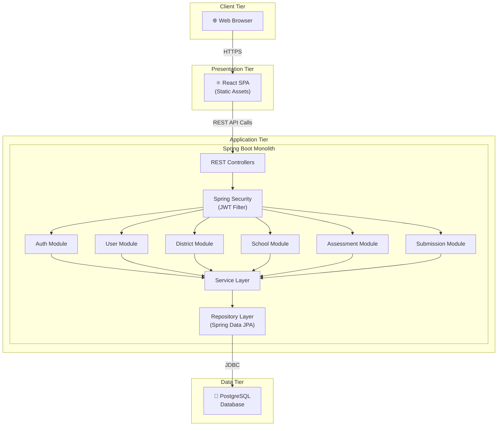

### 11.3 Component Diagram

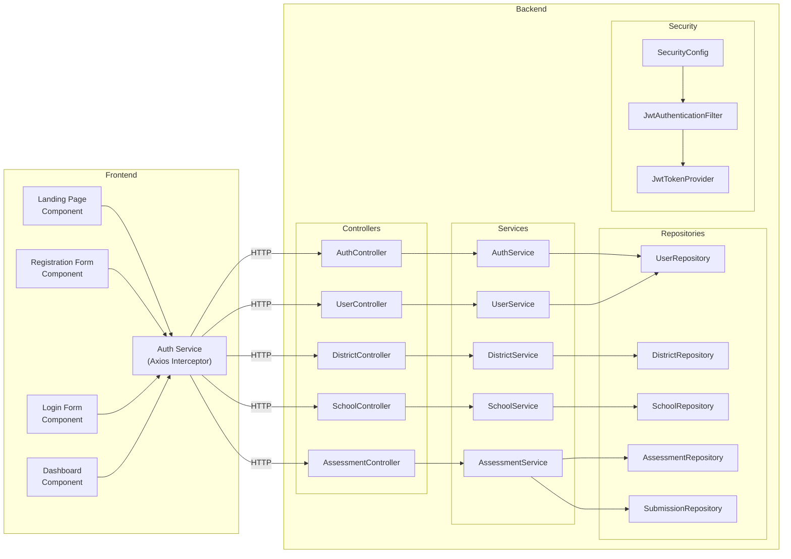

### 11.4 Layered Architecture

The monolithic application follows a strict **layered architecture** pattern:

| Layer            | Responsibility                                                 | Spring Boot Mapping                        |
| ---------------- | -------------------------------------------------------------- | ------------------------------------------ |
| **Presentation** | HTTP request/response handling, input validation, DTO mapping  | `@RestController` classes                  |
| **Security**     | Authentication filter chain, JWT validation, authorization     | `@Configuration` + `OncePerRequestFilter`  |
| **Service**      | Business logic, transaction management, cross-cutting concerns | `@Service` classes                         |
| **Repository**   | Data access abstraction, query definition                      | `@Repository` / `JpaRepository` interfaces |
| **Domain**       | Entity definitions, domain constraints                         | `@Entity` classes                          |

---

<br/>

## 12. High-Level Architecture — Microservices

### 12.1 Overview

The microservices architecture decomposes the Exam Dashboard into independently deployable services, each owning its domain logic and data store. An API Gateway serves as the single entry point, routing requests to the appropriate service and enforcing cross-cutting concerns such as authentication.

### 12.2 Service Decomposition

| Service                | Responsibility                                        | Database        | Port |
| ---------------------- | ----------------------------------------------------- | --------------- | ---- |
| **API Gateway**        | Request routing, rate limiting, CORS, load balancing  | —               | 8080 |
| **Auth Service**       | User registration, login, JWT issuance and validation | `auth_db`       | 8081 |
| **User Service**       | User profile management, role management              | `user_db`       | 8082 |
| **School Service**     | District and school CRUD, teacher/student assignment  | `school_db`     | 8083 |
| **Assessment Service** | Assessment CRUD, submission management                | `assessment_db` | 8084 |

### 12.3 Architecture Diagram

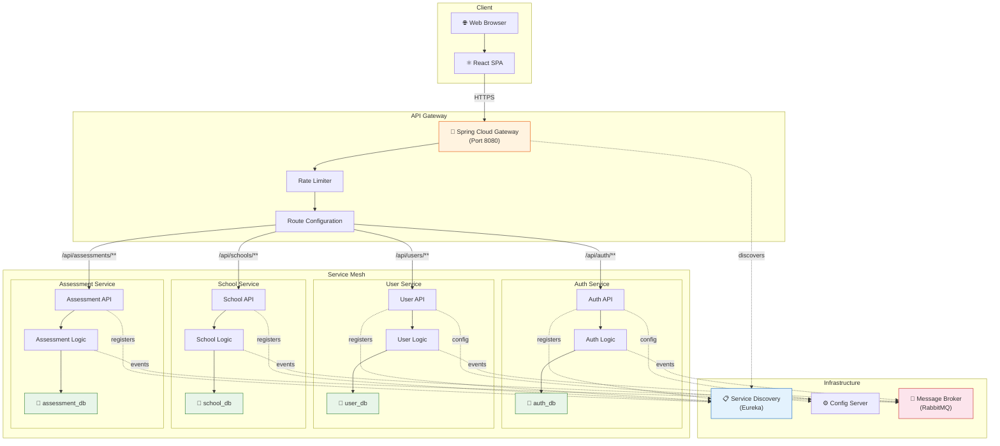

### 12.4 Service Communication

The microservices communicate through two mechanisms:

**Synchronous Communication (REST)**

- Service-to-service HTTP calls for real-time queries.
- Example: Assessment Service calls User Service to validate a teacher's school assignment.
- Mediated by the API Gateway for external traffic; direct service-to-service calls use service discovery.

**Asynchronous Communication (Event-Driven)**

- A message broker (RabbitMQ) handles domain events for eventual consistency.
- Example: When a new user registers in Auth Service, a `UserRegistered` event is published, and User Service creates the profile.

### 12.5 API Gateway Responsibilities

| Concern              | Implementation                                        |
| -------------------- | ----------------------------------------------------- |
| **Routing**          | Path-based routing to downstream services             |
| **Authentication**   | JWT validation at the gateway level before forwarding |
| **Rate Limiting**    | Token bucket algorithm per client IP                  |
| **CORS**             | Centralized CORS policy enforcement                   |
| **Load Balancing**   | Client-side load balancing via service discovery      |
| **Circuit Breaking** | Resilience4j circuit breaker for fault tolerance      |

### 12.6 Database per Service

Each microservice owns its database, enforcing strong domain boundaries:

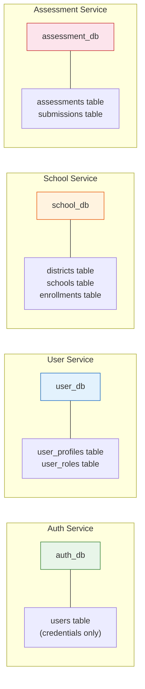

> [!IMPORTANT]
> In a database-per-service model, cross-service joins are not possible. Data consistency is maintained through domain events and eventual consistency patterns. This adds significant complexity that must be weighed against the scalability benefits.

---

<br/>

## 13. Architecture Comparison

### 13.1 Comparison Table

| Dimension               | Monolithic                                                                    | Microservices                                                                           |
| ----------------------- | ----------------------------------------------------------------------------- | --------------------------------------------------------------------------------------- |
| **Complexity**          | Low single codebase, shared data model                                        | High — distributed system, service coordination, eventual consistency                   |
| **Deployment**          | Simple single artifact (JAR/WAR) deployed to one server                       | Complex multiple artifacts, container orchestration (Docker, Kubernetes)                |
| **Scalability**         | Vertical scale the entire application                                         | Horizontal scale individual services independently                                      |
| **Maintainability**     | Moderate manageable for small-to-medium codebases; degrades as codebase grows | High each service is small and focused; easier to understand in isolation               |
| **Development Speed**   | Fast no service coordination overhead; shared codebase                        | Slower initially requires API contracts, service interfaces, and infrastructure setup   |
| **Testing**             | Straightforward integration tests run against a single application            | Complex requires contract testing, service virtualization, and end-to-end orchestration |
| **Database**            | Single shared database simple queries, ACID transactions                      | Database per service eventual consistency, distributed transactions (Saga pattern)      |
| **Team Size**           | Small (2–5 developers)                                                        | Medium to Large (5+ developers with DevOps expertise)                                   |
| **Infrastructure Cost** | Low single server, single database instance                                   | High multiple servers, databases, message broker, service discovery, config server      |
| **Debugging**           | Easy single log stream, stack traces in one process                           | Difficult distributed tracing (Zipkin/Jaeger), correlated log aggregation required      |
| **Suitable For**        | MVPs, small-to-medium applications, limited teams                             | Large-scale applications, independent team ownership, high-traffic services             |
| **Technology Lock-in**  | Single stack across the application                                           | Polyglot services can use different languages and frameworks                            |
| **Fault Isolation**     | Low a bug in one module can crash the entire application                      | High a failing service does not bring down the entire system                            |
| **Time to Market**      | Fast                                                                          | Slow                                                                                    |

<br/>

## 14. Database Design

### 14.1 Design Principles

1. **Single User Entity** All personas (Admin, Teacher, Student) are represented by a single `users` table with a `role` column, avoiding redundant entity tables and simplifying authentication and authorization.
2. **Third Normal Form (3NF)** The schema is normalized to eliminate redundancy and ensure data integrity.
3. **Referential Integrity** All foreign key relationships are enforced at the database level.
4. **Soft Deletes** Entities use an `is_active` flag rather than physical deletion, preserving audit trails and referential integrity.
5. **Timestamps** All entities track `created_at` and `updated_at` timestamps for auditability.

### 14.2 Entity Descriptions

| Entity          | Description                                                                                                           | Key Relationships                                                       |
| --------------- | --------------------------------------------------------------------------------------------------------------------- | ----------------------------------------------------------------------- |
| **users**       | Stores all user accounts with role-based discrimination. Contains authentication credentials and profile information. | Belongs to a school (optional, via `school_id`).                        |
| **districts**   | Represents an administrative district that contains one or more schools.                                              | Has many schools.                                                       |
| **schools**     | Represents an educational institution within a district.                                                              | Belongs to a district. Has many users (teachers and students).          |
| **assessments** | Represents an assessment created by a teacher for students at a school.                                               | Belongs to a user (teacher). Belongs to a school. Has many submissions. |
| **submissions** | Represents a student's submission for an assessment.                                                                  | Belongs to a user (student). Belongs to an assessment.                  |

### 14.3 Table Definitions

#### `users`

| Column          | Type           | Constraints                                               | Description                         |
| --------------- | -------------- | --------------------------------------------------------- | ----------------------------------- |
| `id`            | `BIGSERIAL`    | `PRIMARY KEY`                                             | Unique user identifier              |
| `first_name`    | `VARCHAR(100)` | `NOT NULL`                                                | User's first name                   |
| `last_name`     | `VARCHAR(100)` | `NOT NULL`                                                | User's last name                    |
| `email`         | `VARCHAR(255)` | `NOT NULL, UNIQUE`                                        | Login email address                 |
| `password_hash` | `VARCHAR(255)` | `NOT NULL`                                                | BCrypt-hashed password              |
| `role`          | `VARCHAR(20)`  | `NOT NULL, CHECK (role IN ('ADMIN','TEACHER','STUDENT'))` | User role for RBAC                  |
| `school_id`     | `BIGINT`       | `FOREIGN KEY → schools(id), NULLABLE`                     | Associated school (NULL for admins) |
| `is_active`     | `BOOLEAN`      | `NOT NULL, DEFAULT TRUE`                                  | Soft delete flag                    |
| `created_at`    | `TIMESTAMP`    | `NOT NULL, DEFAULT NOW()`                                 | Record creation timestamp           |
| `updated_at`    | `TIMESTAMP`    | `NOT NULL, DEFAULT NOW()`                                 | Last modification timestamp         |

#### `districts`

| Column        | Type           | Constraints               | Description                 |
| ------------- | -------------- | ------------------------- | --------------------------- |
| `id`          | `BIGSERIAL`    | `PRIMARY KEY`             | Unique district identifier  |
| `name`        | `VARCHAR(200)` | `NOT NULL, UNIQUE`        | District name               |
| `code`        | `VARCHAR(20)`  | `NOT NULL, UNIQUE`        | Short code for the district |
| `description` | `TEXT`         | `NULLABLE`                | Optional description        |
| `is_active`   | `BOOLEAN`      | `NOT NULL, DEFAULT TRUE`  | Soft delete flag            |
| `created_at`  | `TIMESTAMP`    | `NOT NULL, DEFAULT NOW()` | Record creation timestamp   |
| `updated_at`  | `TIMESTAMP`    | `NOT NULL, DEFAULT NOW()` | Last modification timestamp |

#### `schools`

| Column        | Type           | Constraints                             | Description                 |
| ------------- | -------------- | --------------------------------------- | --------------------------- |
| `id`          | `BIGSERIAL`    | `PRIMARY KEY`                           | Unique school identifier    |
| `name`        | `VARCHAR(200)` | `NOT NULL`                              | School name                 |
| `code`        | `VARCHAR(20)`  | `NOT NULL, UNIQUE`                      | Short code for the school   |
| `address`     | `VARCHAR(500)` | `NULLABLE`                              | Physical address            |
| `district_id` | `BIGINT`       | `NOT NULL, FOREIGN KEY → districts(id)` | Parent district             |
| `is_active`   | `BOOLEAN`      | `NOT NULL, DEFAULT TRUE`                | Soft delete flag            |
| `created_at`  | `TIMESTAMP`    | `NOT NULL, DEFAULT NOW()`               | Record creation timestamp   |
| `updated_at`  | `TIMESTAMP`    | `NOT NULL, DEFAULT NOW()`               | Last modification timestamp |

#### `assessments`

| Column        | Type           | Constraints                                                                   | Description                          |
| ------------- | -------------- | ----------------------------------------------------------------------------- | ------------------------------------ |
| `id`          | `BIGSERIAL`    | `PRIMARY KEY`                                                                 | Unique assessment identifier         |
| `title`       | `VARCHAR(300)` | `NOT NULL`                                                                    | Assessment title                     |
| `description` | `TEXT`         | `NULLABLE`                                                                    | Detailed description or instructions |
| `due_date`    | `TIMESTAMP`    | `NOT NULL`                                                                    | Submission deadline                  |
| `status`      | `VARCHAR(20)`  | `NOT NULL, DEFAULT 'DRAFT', CHECK (status IN ('DRAFT','PUBLISHED','CLOSED'))` | Lifecycle status                     |
| `teacher_id`  | `BIGINT`       | `NOT NULL, FOREIGN KEY → users(id)`                                           | Creating teacher                     |
| `school_id`   | `BIGINT`       | `NOT NULL, FOREIGN KEY → schools(id)`                                         | Target school                        |
| `is_active`   | `BOOLEAN`      | `NOT NULL, DEFAULT TRUE`                                                      | Soft delete flag                     |
| `created_at`  | `TIMESTAMP`    | `NOT NULL, DEFAULT NOW()`                                                     | Record creation timestamp            |
| `updated_at`  | `TIMESTAMP`    | `NOT NULL, DEFAULT NOW()`                                                     | Last modification timestamp          |

#### `submissions`

| Column          | Type           | Constraints                               | Description                        |
| --------------- | -------------- | ----------------------------------------- | ---------------------------------- |
| `id`            | `BIGSERIAL`    | `PRIMARY KEY`                             | Unique submission identifier       |
| `content`       | `TEXT`         | `NOT NULL`                                | Student's submitted response       |
| `submitted_at`  | `TIMESTAMP`    | `NOT NULL, DEFAULT NOW()`                 | Timestamp of submission            |
| `grade`         | `DECIMAL(5,2)` | `NULLABLE`                                | Assigned grade (NULL until graded) |
| `feedback`      | `TEXT`         | `NULLABLE`                                | Teacher feedback                   |
| `student_id`    | `BIGINT`       | `NOT NULL, FOREIGN KEY → users(id)`       | Submitting student                 |
| `assessment_id` | `BIGINT`       | `NOT NULL, FOREIGN KEY → assessments(id)` | Target assessment                  |
| `created_at`    | `TIMESTAMP`    | `NOT NULL, DEFAULT NOW()`                 | Record creation timestamp          |
| `updated_at`    | `TIMESTAMP`    | `NOT NULL, DEFAULT NOW()`                 | Last modification timestamp        |

### 14.4 Indexes

| Table         | Index Name                      | Columns                     | Type   | Rationale                                 |
| ------------- | ------------------------------- | --------------------------- | ------ | ----------------------------------------- |
| `users`       | `idx_users_email`               | `email`                     | UNIQUE | Fast login lookup                         |
| `users`       | `idx_users_role`                | `role`                      | B-TREE | Filter users by role                      |
| `users`       | `idx_users_school_id`           | `school_id`                 | B-TREE | Find users in a school                    |
| `schools`     | `idx_schools_district_id`       | `district_id`               | B-TREE | Find schools in a district                |
| `assessments` | `idx_assessments_teacher_id`    | `teacher_id`                | B-TREE | Find assessments by teacher               |
| `assessments` | `idx_assessments_school_id`     | `school_id`                 | B-TREE | Find assessments by school                |
| `assessments` | `idx_assessments_status`        | `status`                    | B-TREE | Filter by lifecycle stage                 |
| `submissions` | `idx_submissions_student_id`    | `student_id`                | B-TREE | Find student's submissions                |
| `submissions` | `idx_submissions_assessment_id` | `assessment_id`             | B-TREE | Find submissions for an assessment        |
| `submissions` | `idx_submissions_unique`        | `student_id, assessment_id` | UNIQUE | One submission per student per assessment |

---

<br/>

## 15. ER Diagram

### 15.1 Entity-Relationship Diagram

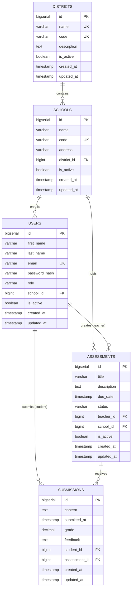

### 15.2 Relationship Summary

| Relationship                | Cardinality | Description                                                                                                                  |
| --------------------------- | ----------- | ---------------------------------------------------------------------------------------------------------------------------- |
| District → School           | One-to-Many | A district contains many schools; a school belongs to exactly one district.                                                  |
| School → User               | One-to-Many | A school has many users (teachers and students); a user belongs to at most one school. Admins may have no school assignment. |
| School → Assessment         | One-to-Many | A school hosts many assessments; each assessment is scoped to one school.                                                    |
| User (Teacher) → Assessment | One-to-Many | A teacher creates many assessments; each assessment has one creating teacher.                                                |
| User (Student) → Submission | One-to-Many | A student makes many submissions (across different assessments); each submission belongs to one student.                     |
| Assessment → Submission     | One-to-Many | An assessment receives many submissions; each submission is for one assessment.                                              |

---

<br/>

## 16. Authentication Flow

### 16.1 Authentication vs. Authorization

| Concept            | Definition                                           | Exam Dashboard Implementation                                                                                                                               |
| ------------------ | ---------------------------------------------------- | ----------------------------------------------------------------------------------------------------------------------------------------------------------- |
| **Authentication** | Verifying _who_ a user is confirming their identity. | The login endpoint validates the user's email and password against the stored BCrypt hash. Upon success, a JWT access token is issued as proof of identity. |

### 16.2 Registration Flow

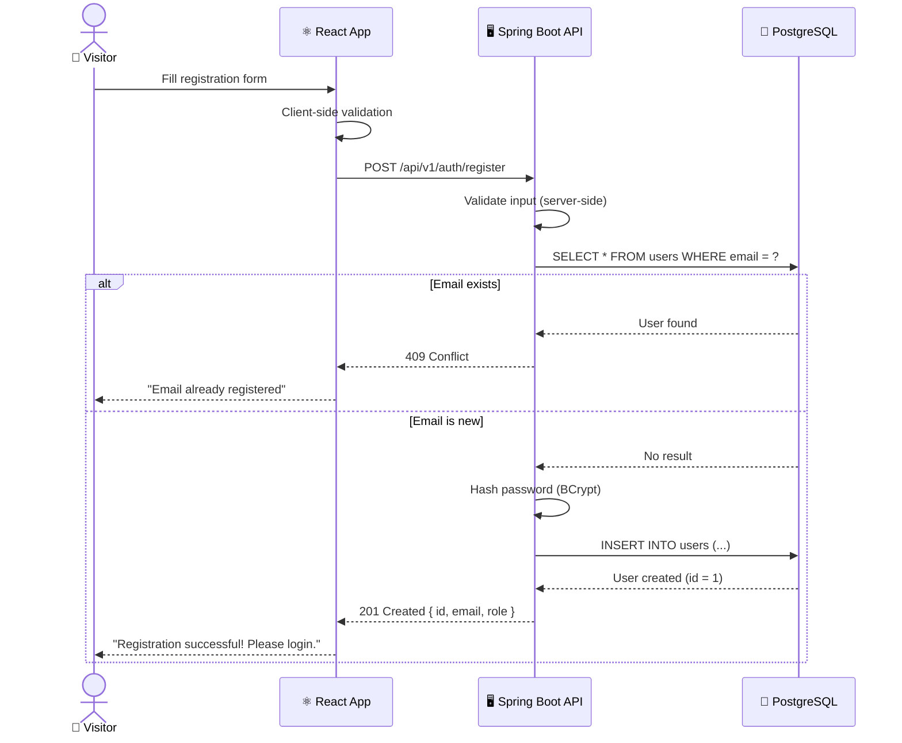

### 16.3 Login Flow

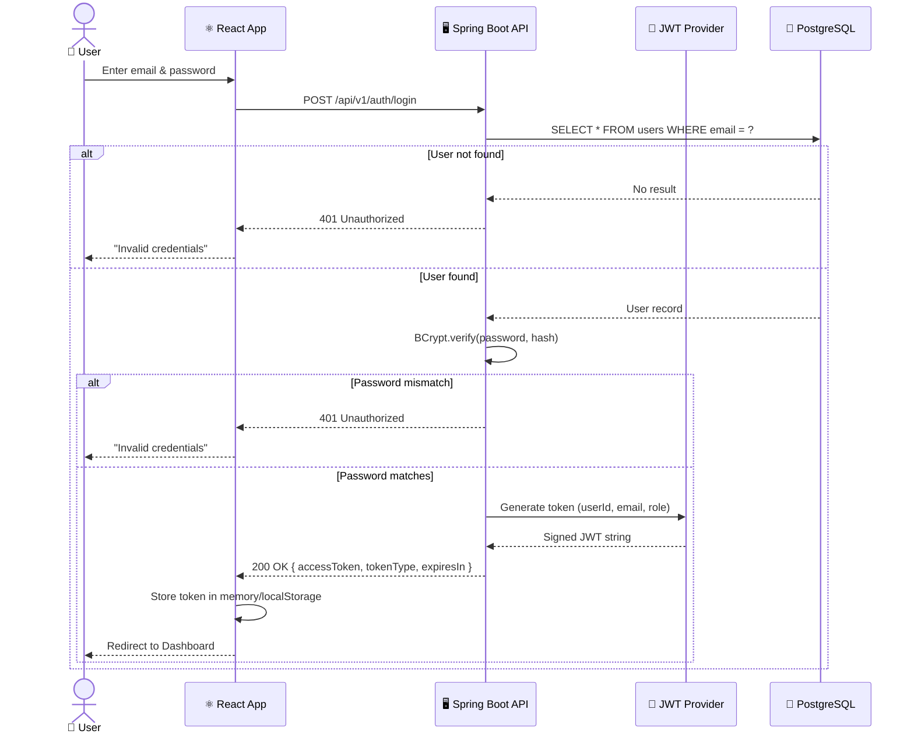

<br/>

## 17. JWT Flow

### 17.1 What is JWT?

**JSON Web Token (JWT)** is an open standard (RFC 7519) for securely transmitting information between parties as a JSON object. The token is digitally signed using a secret key (HMAC) or a public/private key pair (RSA/ECDSA), ensuring its integrity and authenticity.

### 17.2 JWT Structure

A JWT consists of three Base64-encoded segments separated by dots:

```
Header.Payload.Signature
```

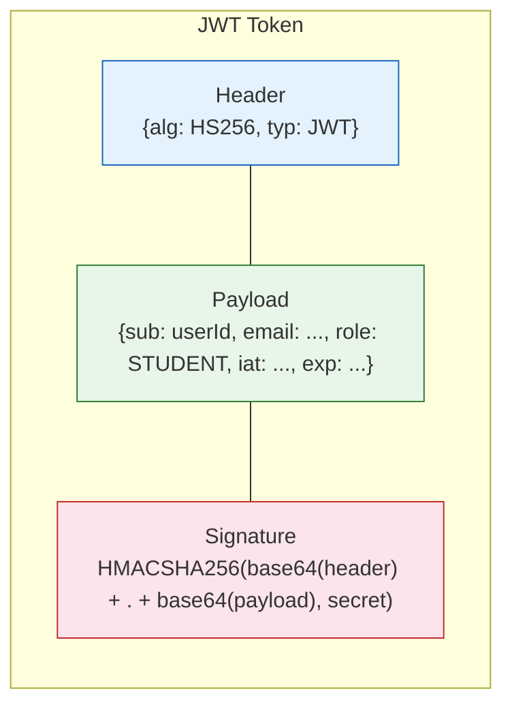

| Segment       | Content                                                                                                | Purpose                                                                                                    |
| ------------- | ------------------------------------------------------------------------------------------------------ | ---------------------------------------------------------------------------------------------------------- |
| **Header**    | `{ "alg": "HS256", "typ": "JWT" }`                                                                     | Specifies the signing algorithm and token type                                                             |
| **Payload**   | `{ "sub": "1", "email": "user@example.com", "role": "STUDENT", "iat": 1722355200, "exp": 1722441600 }` | Contains claims about the user; `sub` (subject), `iat` (issued at), `exp` (expiration) are standard claims |
| **Signature** | `HMACSHA256(base64UrlEncode(header) + "." + base64UrlEncode(payload), secret)`                         | Ensures the token has not been tampered with                                                               |

### 17.3 Token Lifecycle

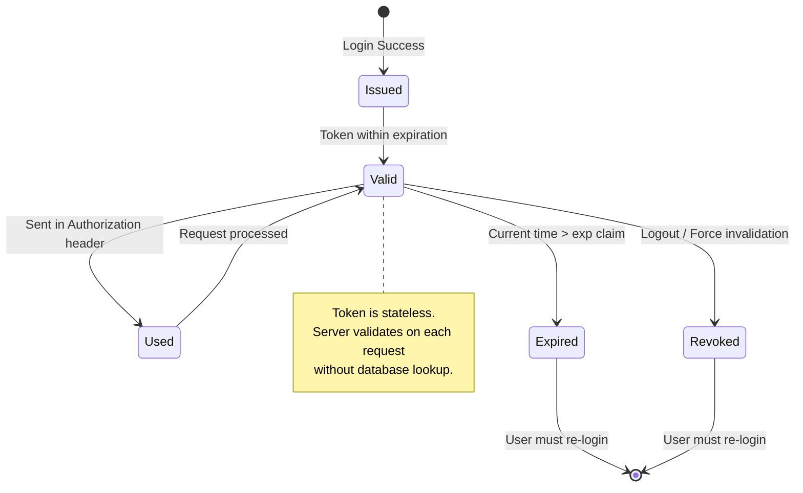

## 18. Future Enhancements

The following features are acknowledged as high-value enhancements that the architecture is designed to accommodate in future releases. They are documented here to ensure architectural foresight without committing to implementation timelines.

### 18.1 Enhancement Details

| Enhancement             | Description                                                                                                                                                                       | Architectural Impact                                                                                                           |
| ----------------------- | --------------------------------------------------------------------------------------------------------------------------------------------------------------------------------- | ------------------------------------------------------------------------------------------------------------------------------ |
| **Parent Portal**       | A new `PARENT` role allowing parents to view their children's assessments, submissions, and grades. Requires a `parent_student` junction table for the many-to-many relationship. | New role in RBAC; new entity; additional API endpoints.                                                                        |
| **Analytics Dashboard** | Real-time dashboards showing assessment completion rates, average grades by school/district, and teacher activity metrics.                                                        | May require a read-replica database or caching layer (Redis) for aggregation queries.                                          |
| **Notification System** | Email and in-app notifications for assessment deadlines, grade postings, and system announcements.                                                                                | Requires a notification service, email provider integration (SendGrid/SES), and WebSocket support for real-time in-app alerts. |
| **Reports Engine**      | Exportable reports (PDF, CSV) for district administrators showing assessment analytics, student performance trends, and compliance metrics.                                       | Requires asynchronous report generation (background jobs) and file storage (S3 or equivalent).                                 |
| **Email Verification**  | Upon registration, users receive an email with a verification link. Accounts are inactive until verified.                                                                         | Requires email service integration and a `verified` flag on the `users` table.                                                 |
| **Password Recovery**   | Self-service password reset via email with a time-limited, single-use token.                                                                                                      | Requires a `password_reset_tokens` table and email service integration.                                                        |
| **Mobile Application**  | Native iOS and Android applications consuming the same REST API.                                                                                                                  | No backend changes required; API is already mobile-ready. May need push notification infrastructure.                           |

---

<br/>

## 19. Conclusion

This System Design Document presents a comprehensive architectural blueprint for the **Exam Dashboard** a web-based platform that centralizes educational institution management and assessment workflows. The document covers the full spectrum of system design concerns:

<br/>

---

<div align="center">

_— End of Document —_

**Exam Dashboard : System Design Document v1.0**

**Prepared by Ayman Negm**

**July 2026**

</div>
